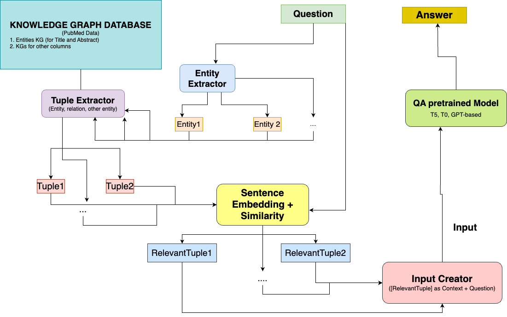
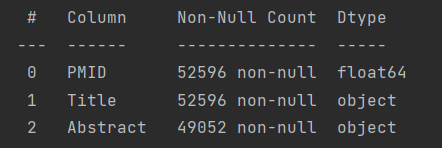

# Introduction

One of the greatest challenges in NLP is Open-Domain Question-Answering (QA)
task, which requires models to not only be able to generate correct answers gram-
matically, but also be able to provide the precise answer to the given question. This
demands the model to gather large source of knowledge to find an effective solu-
tion. As the growth of deep learning in this decade, pre-trained Language Models
such as BERT (Devlin et al., 2019), T5 (Raffel et al., 2020) and recently LLama
2 (Touvron et al., 2023) have already made a remarkable result over this task, as
they were pre-trained on a large amount of text corpora, and those models, hence,
can solve the task using their internal knowledge they obtained during pre-training
without requesting additional ones (Roberts et al., 2020). If model sizes are in-
creased, Large Language Models (LLMs) can in fact generate answers for the
given questions without any external knowledge needed from fine-tuning (Brown
et al., 2020). However, an another obstacle found through this work that was ex-
perimented on GPT-3 is that the internal knowledge in LLMs might not be complete
and relevant, thus leads LLMs to generate wrong factual answers, in other words,
hallucination (Rohrbach et al., 2018). This problem can also become worse when
applying LLMs on domain-specific data because of restriction in those corpora
and dealing with hallucinations becomes significantly more challenging.

To overcome this limitation, instead of working on improving LLMs over the QA
task, an another solution is to enrich the knowledge to the input fed into the pre-
trained models. This approach does not only save computational cost when up-
dating LLMs, but also helps to guide LLMs to detect the correct factual answers,
as this improves their abilities to recall knowledge not only during training time
(Yang et al., 2023).

A possible type of knowledge that could achieve this goal comes from knowledge
graph (KG) related to the entities in the given questions. By going through knowl-
edge based on entity relations, LLMs can reasonably figure out the correct facts
related to the questions, and thus, can generate validated factual answers. Based
on this observation, in recent research, KAPING, a framework that augmented
knowledge from KGs was proposed (Baek et al., 2023), which focuses solemnly
on enriching the inputs and requires no model updating, in short, a zero-shot
method. Inspired by this framework idea about knowledge graphs, we applied
this to our Retrieval-Augmented Generation framework SmartPub with the goal to
build a simple but efficient QA system on the PubMed Data.

# Related Works

## Finetuning pre-trained LLMs on QA Task

Being one of the most challenging tasks in text generation field besides text sum-
marization, Question Answering, or specifically Open-Domain Question Answer-
ing (Open-Domain QA), there have been a lot of Large Language Models like
BERT (Devlin et al., 2019), T5 (Raffel et al., 2020) and recently LLama 2 Touvron
et al. (2023) developed to achieve high qualitative performance. Those LLMs after
pre-training on massive text corpora have relatively great amount of parameters
representing the world knowledge they obtained during the process. These knowl-
edge become their source to generate the required text (’answer’) based on given
context (or the ’question’ in Open-Domain QA).

However, as language keeps growing and the complexity of the questions in-
creases due to different research purposes, current pre-trained models do not
have enough knowledge to fulfill the expectations. Hence updating is neces-
sary, in other words, ’fine-tuning’. As there are many types of different questions
which can be solved separately as subtasks from QA, corresponding datasets with
benchmark like SQuAD (Rajpurkar et al., 2016), TruthfulQA (Lin et al., 2021), or
domain-specific like PubMedQA (Jin et al., 2019), ... were created and many work
focused on fine-tuning LLMs on them such as T0 on SQuAD (Sanh et al., 2021),
TruthX on TruthfulQA (Zhang et al., 2024) or BioGPT for PubMedQA (Luo et al.,
2022). Much attention towards this approach, however, the biggest obstacle that
fine-tuning has is to be a not computationally time- and space-friendly approach,
because of the size of the LLMs (which can reach hundreds billions). Therefore,
recent work paid more attention to approaches that overcome such problem but
still acquire good performance as fine-tuning. Zero-shot method is one of those.

## Retrieval-Augmented Generation (RAG) and Language Model Prompting (LM Prompting)

Being among the recent zero-shot methods that effectively address hallucination,
both Retrieval Augmented Generation (RAG) (Guu et al., 2020; Lewis et al., 2021)
and Language Model Prompting (LM Prompting) (Brown et al., 2020; Baek et al.,
2023) aim to enhance the knowledge of pre-trained Language Models (LLMs).
They achieve this by identifying the most appropriate contexts from additional pro-
vided knowledge, guiding them to generate more factual answers. Consequently, these methods attain higher performance in Open-Domain QA tasks without the
need for parameter updates like fine-tuning.

# Methodology

## Our system

Inspired by the methodology from KAPING (Baek et al., 2023), we proposed a
simple but promising approach to overcome the problem of hallucination. In their
LM Prompting work, KAPING relied on the open source Wikipedia articles and
used entities extracted from this open source to build the entities-based knowledge
graphs.

Similarly, in our RAG system SmartPub, instead of retrieving the raw documents
and looking for the most similar documents based on those raw sequences, we
built a knowledge graph database for all the entities using off-the-shelf framework
REBEL - a BART (Lewis et al., 2019)-based model (Huguet Cabot and Navigli,
2021), a text-relation extraction model that achieves currently state-of-the-art for
different datasets.

The whole process is as follows: Given a question as the query, we searched in
our built-in knowledge graph database to retrieve the top k most similar documents
to the question (by comparing cosine similarity of their sentence embeddings).
Detail can be seen in Figure 3.

Figure 1: SmartPub Process

## Knowledge Graph

As the base unit to build our QA system, we built a knowledge graph (Baek
et al., 2023) to represent the semantic relationship between various entities in the
dataset. We believed that using a knowledge graph would greatly enhance the
performance and capabilities of our QA system as it breaks down any text data
(semi-structured in this case) into entities along with their semantic understanding
(is-a, “part-of”, “has-cause”, “opposite-of” etc). This approach aids relevant infor-
mation retrieval and answer extraction against each question. We attempted to
leverage this approach for better performance of our system, especially since the
domain could have a rich semantic relationship with the entities.

For example from an article (PMID: 29288867) that goes like ’The hippocampus
is a highly stress susceptible structure and hippocampal abnormalities have been
reported in a host of psychiatric disorders including major depression and post-
traumatic stress disorder (PTSD). The hippocampus appears to be...’ will have
triplets such as [’head’: ’post-traumatic stress disorder’, ’type’: ’subclass of’, ’tail’:
’psychiatric disorders’], [’head’: ’anxiety disorder’, ’type’: ’subclass of’, ’tail’: ’psy-
chiatric disorders’], etc.

## Vector Database

We use Pinecone as our main vector database to embed the relations extracted
by the KG. We employed various embeddings, which will be further described in
the section 4.3.1.

# Experiments

## Data

### Pubmed Dataset

We collected data from PubMed using the word ”intelligence” from 2013 to 2023,
we get a bunch of information about different research papers. This information in-
cludes things like the ID number of each paper (called PMID), the title of the paper,
a summary of what the paper is about (called abstract), keywords that describe the
main topics, the names of the people who wrote the paper, the journals where the
papers were published, the years and months when they were published, where
the data came from, and the countries where the research was done.

### Understanding the Dataset

To better understand the Pubmed dataset extracted (the subset containing ‘intel-
ligence‘), we performed certain statistical analysis. The dataset contains 52596
entries with columns PMID - the pubmed id, ‘Title’ - title of the article, ‘Abstract’ -
abstract, ‘Authors’ - names of involved authors, ‘Journal’ - the name of the journal
in which the article was published, ‘Year’ - year of publication, ‘Month’ - month of
publication, ‘Source’ - source of the article, ‘Country’ - country of publication.
All the extracted data had non-empty fields and about 93.2% of the entries had
non-empty abstracts. See Figure 2.

We further performed an analysis to understand the distribution of keyword ‘intel-
ligence’ over the year. The distribution can be found in the figure 3.

To understand the level of involvement of authors, the authors who collaborated
together, we performed some analysis on that as well. However, the results are
not included here as in a later stage, it went out of scope of our project plan.

From these roughly 52.6k articles, we extracted the knowledge graph in the form
of triplets (entity1, relation, entity2). We extracted 235735 triplets which were used
in the pipeline for further processing.

Figure 2: Non-empty Context

Figure 3: Frequency distribution of intelligence over the
years

### Question Answer Sets

During our research, we came across PubmedQA dataset by Jin et al. (2019)
which is a question answering dataset consisting of question, structured context,
long answer and yes/no/maybe answer. Furthermore, the dataset has three sub-
sets: PQA-L (labeled), PQA-U (unlabelled), PQA-A (Artificial) To leverage this
dataset for the specific scope of this project, we extracted a subset of their ar-
tificially generated dataset(211.3k) that contains the keyword ‘intelligence’ to get
about 250 question answer sets.

**Synthetic Data**

Jin et al. (2019) use POS-Tagging to find documents that have 1.) a statement
title meaning a POS-structure of NP-(VBP/VBZ) and 2.) an abstract that contains
a labelled conclusion. Many documents in the dataset follow a structure for their
abstract that contains clearly labelled sections e.g. ’INTRODUCTION:’, ’CONCLUSION:’. The Title is then transformed into a question by adding copulas or
auxiliary verbs as well as a question mark. The correct answer was determined
by assessing the negation status of the VBP. We collected 374 questions overall
but they were of mostly poor quality e.g. ”Is Significance of natural language pro-
cessing and chat-based generative language models?”. So we manually rewrote
50 of them to use as our test set.

## Knowledge Graph Generation

To generate the knowledge graph (Baek et al., 2023), we make use of Babelscape’s
REBEL (Relation Extraction By End-to-end Language generation) (Huguet Cabot
and Navigli, 2021) that simplifies relation extraction as a sequence to sequence
task for over 200 relation types.

The extracted PubMed dataset is cleaned to handle irrelevant data such as empty
fields. The content is primarily derived from the title and abstracts, which can
directly be fetched from the PubMed dataset. The code utilizes the pipeline func-
tionality from the transformers library to easily load and use the REBEL model for
relation extraction. This pipeline is used to generate text from input text, which
contains triplets representing relationships between entities.

Relevant information such as title, abstract, Pubmed ID, authors and date pub-
lished are extracted through iteration. Triplets are then generated by parsing
through the title and the abstract separately.

For those abstracts that exceed the model’s maximum token length, a text splitting
mechanism is used. The mechanism used is a sliding window approach which
processes each segment independently, and the results are aggregated, main-
taining consistency in the generated triplets.

These triplets are then coupled with its associated details such as PubMed id,
authors, date published etc for further processing in the project pipeline.
During our experiments we attempted to use mutli-processing pool and GPU exe-
cution. Unfortunately we did not yield any sufficient boost with the multiprocessing strategy. Hence we ended up using the GPU execution.

## Information Retrieval Methods

Information Retrieval (IR) stands out as a key component of a RAG system. If
the retrieved context is of poor quality, it not only fails to assist but, in some in-
stances, may even hinder the model in providing accurate answers. Therefore we
evaluated different possible methods, like statistical methods (BM25) and different
embedding types.

### Data and Setup

For our evaluation we used the question-answer pairs described in 4.2.
The goal is to evaluate the methods based on their ability to retrieve accurate
context. This was achieved by posing the following question to a large language
model (LLM): ”With the following context: {top similar docs}. This is a question:
{query}. Can the question be answered with the provided context? Please re-
spond with ’Yes’ or ’No’.” The model employed was GPT-3.5 by way of ChatGPT.

**BM25**

Our very first attempt at retrieving documents relevant to the query was
done using Okapi BM25. This is a classic statistical information
retrieval function, which was conceived for this very purpose.
Specifically used was a BM25 function that uses the
inverse-document-frequency (IDF) as a weight, which is one of the most
prominent approaches. With $Q = \{q_1, q_2, …,q_3\}$, where Q is the
query and $q_i$ is a keyword and D as a document:

$$\text{score}(D, Q) = \sum_{i=1}^n \text{IDF}(q_i) \frac{(q_i \, \text{in} \, D) \cdot (k1+1)}{(q_i \, \text{in} \, D) + k1 \left(1 - b + b \cdot \frac{|D|}{\text{avrg-doc-len}}\right)}$$

k1 and b are free parameters that can be optimized. We choose the
commonly used values k1 = 1.2 and b = 0.75.

**Sentence Embeddings**

The embedding used in the final model are ’sentence-transformers/all-MiniLM-L6-
v2’ (in further text referred to as MiniLM) from HuggingFace. This embedding is
originally based on the work of Wang et al. (2020), but was fine-tuned on a dataset
comprising 1 billion sentence pairs. The core of the training strategy involves a
contrastive learning objective, where the model is tasked with predicting, from a
given sentence within a pair, which among a set of randomly sampled alternative
sentences was originally paired with it in our dataset.

In our search for different and potentially better embeddings, we also explored the
use of BERT Devlin et al. (2019). This was one of the very first transformer-based
embeddings and is still widely used today.

**Question Answering Model**

We used the Llama 2 Chat HF 13B (Touvron et al., 2023), which have enough
capacity for our resource but was proven to have relative high performance (almost
state-of-the-art) in QA task. All settings were used as default from the pre-trained
model setup.

### Results and Analysis

**BM25**

For BM25 we determined in not documented small experiments very early on
and then confirmed it by manual evaluation later that this method does
not retrieve relevant documents. For details please see the table below.
It also seemingly prefers short documents over long ones. Penalising
long documents unfairly is a known problem of BM25, but we were unsure
if it was applicable here, as the retrieved documents were considerably
below the average token count of all documents, which means that it did
not retrieve many average-length documents either.

We considered trying to mitigate this by implementing BM25+, which
introduces a lower bound, but decided against it since even the
retrieved average-length documents were not relevant. The poor results
led us to decide against trying other term-frequency metrics and,
instead, to explore alternative methods.

**Embeddings**

Unfortunately, the results for the evaluation of the embeddings proved
to be less than satisfactory. Evaluation showed that for the MiniLM
model only 42% of question were able to be answered by the retrieved
context. For BERT the results proved to be even less satisfactory.
Further details can be found in the table.

We explain this bad showing by BERT as it being one of the first models
from 2018 and therefore not being state-of-the-art anymore. For the
MiniLM the bad results could be a result of the downsizing done not only
in the original paper but also in the embedding itself.

:::
  Answers  |  Yes |  No |  Total |  Percentage Yes  
  ---------|----- |---- |------- |------------------
  MiniLM   |  21  |  39 |  50   |       42%        
  BERT     |  14  |  36 |  50   |       28%        
  BM25     |   5  |  25 |  30   |       16%        

::: 

This table displays the evaluation of various context retrieval
methods concerning their ability to answer the posed question. MiniLM
and BERT utilised cosine similarity to determine the most relevant
vectors.  

# Conclusions

In this project, we built a medical domain chatbot with Llama, based
conceptually on the ideas of RAG. Specifically, we employed an embedded
knowledge graph and retrieved relevant information from documents in the
PubMed database using cosine similarity.

In future work we would try to improve our IR method. Our current model
has a successful retrieval rate of under 50% which is insufficient. We
also would include more evaluation of the answers the model gives us.

# Contributions

Key contributions from the team members

Blanca Birn: Question Answer Sets (synthetic), IR Experiments,
Vector-Database (Pinecone)\
Dang Hoang Dung Nguyen: Vector-Database Retrieval (Pinecone) as
necessary knowledge, Question Answering System completely as Backend,
Entity Relations Statistics, (backup, but not used fully in experiments:
KAPING framework, Evaluation Metrics, Other pre-trained model as QA
system for LM Prompting)\
Mani Smaran Nair: Data extraction, Modular coding of the notebook,
Frontend using flask\
Maria Mathews: Question Answer Sets, Statistical Analysis of Data,
Knowledge Graph Generation, Relevant Information Retrieval(with different
embeddings - for experiments), env Resolution

# Confirmation of Own Work

We hereby certify that we have written the work ourselves and that we
have not used any sources or aids other than those specified and that we
have marked what has been taken over from other people's works, either
verbatim or in terms of content, as foreign.

# References

Jacob Devlin, Ming-Wei Chang, Kenton Lee, and Kristina Toutanova. BERT: Pre-
training of deep bidirectional transformers for language understanding. In Pro-
ceedings of the 2019 Conference of the North American Chapter of the Asso-
ciation for Computational Linguistics: Human Language Technologies, Volume
1 (Long and Short Papers), pages 4171–4186, Minneapolis, Minnesota, June
2019. Association for Computational Linguistics. doi: 10.18653/v1/N19-1423  [Titel anhand dieser DOI in Citavi-Projekt übernehmen] .
URL https://aclanthology.org/N19-1423.

Colin Raffel, Noam Shazeer, Adam Roberts, Katherine Lee, Sharan Narang,
Michael Matena, Yanqi Zhou, Wei Li, and Peter J. Liu. Explor-
ing the limits of transfer learning with a unified text-to-text transformer.
Journal of Machine Learning Research, 21(140):1–67, 2020. URL
http://jmlr.org/papers/v21/20-074.html.

Hugo Touvron, Louis Martin, Kevin Stone, Peter Albert, Amjad Almahairi, Yasmine
Babaei, Nikolay Bashlykov, Soumya Batra, Prajjwal Bhargava, Shruti Bhosale,
Dan Bikel, Lukas Blecher, Cristian Canton Ferrer, Moya Chen, Guillem Cucu-
rull, David Esiobu, Jude Fernandes, Jeremy Fu, Wenyin Fu, Brian Fuller, Cyn-
thia Gao, Vedanuj Goswami, Naman Goyal, Anthony Hartshorn, Saghar Hos-
seini, Rui Hou, Hakan Inan, Marcin Kardas, Viktor Kerkez, Madian Khabsa,
Isabel Kloumann, Artem Korenev, Punit Singh Koura, Marie-Anne Lachaux,
Thibaut Lavril, Jenya Lee, Diana Liskovich, Yinghai Lu, Yuning Mao, Xavier Mar-
tinet, Todor Mihaylov, Pushkar Mishra, Igor Molybog, Yixin Nie, Andrew Poulton,
Jeremy Reizenstein, Rashi Rungta, Kalyan Saladi, Alan Schelten, Ruan Silva,
Eric Michael Smith, Ranjan Subramanian, Xiaoqing Ellen Tan, Binh Tang, Ross
Taylor, Adina Williams, Jian Xiang Kuan, Puxin Xu, Zheng Yan, Iliyan Zarov,
Yuchen Zhang, Angela Fan, Melanie Kambadur, Sharan Narang, Aurelien Ro-
driguez, Robert Stojnic, Sergey Edunov, and Thomas Scialom. Llama 2: Open
foundation and fine-tuned chat models, 2023.

Adam Roberts, Colin Raffel, and Noam Shazeer. How much knowledge can
you pack into the parameters of a language model? In Proceedings of
the 2020 Conference on Empirical Methods in Natural Language Process-
ing (EMNLP), pages 5418–5426, Online, November 2020. Association for
Computational Linguistics. doi: 10.18653/v1/2020.emnlp-main.437.  [Titel anhand dieser DOI in Citavi-Projekt übernehmen]  URL
https://aclanthology.org/2020.emnlp-main.437.

Tom B. Brown, Benjamin Mann, Nick Ryder, Melanie Subbiah, Jared Ka-
plan, Prafulla Dhariwal, Arvind Neelakantan, Pranav Shyam, Girish Sastry,
Amanda Askell, Sandhini Agarwal, Ariel Herbert-Voss, Gretchen Krueger,
Tom Henighan, Rewon Child, Aditya Ramesh, Daniel M. Ziegler, Jeffrey
Wu, Clemens Winter, Christopher Hesse, Mark Chen, Eric Sigler, Ma-
teusz Litwin, Scott Gray, Benjamin Chess, Jack Clark, Christopher Berner,
Sam McCandlish, Alec Radford, Ilya Sutskever, and Dario Amodei. Lan-
guage models are few-shot learners. CoRR, abs/2005.14165, 2020. URL
https://arxiv.org/abs/2005.14165.

Anna Rohrbach, Lisa Anne Hendricks, Kaylee Burns, Trevor Darrell, and
Kate Saenko. Object hallucination in image captioning. In Proceedings of
the 2018 Conference on Empirical Methods in Natural Language Process-
ing, pages 4035–4045, Brussels, Belgium, October-November 2018. Asso-
ciation for Computational Linguistics. doi: 10.18653/v1/D18-1437.  [Titel anhand dieser DOI in Citavi-Projekt übernehmen]  URL
https://aclanthology.org/D18-1437.

Linyao Yang, Hongyang Chen, Zhao Li, Xiao Ding, and Xindong Wu. Chatgpt
is not enough: Enhancing large language models with knowledge graphs for
fact-aware language modeling, 2023.

Jinheon Baek, Alham Fikri Aji, and Amir Saffari. Knowledge-augmented language
model prompting for zero-shot knowledge graph question answering, 2023.
Pranav Rajpurkar, Jian Zhang, Konstantin Lopyrev, and Percy Liang. Squad: 100,
000+ questions for machine comprehension of text. CoRR, abs/1606.05250,
2016. URL http://arxiv.org/abs/1606.05250.

Stephanie Lin, Jacob Hilton, and Owain Evans. Truthfulqa: Measuring how
models mimic human falsehoods. CoRR, abs/2109.07958, 2021. URL
https://arxiv.org/abs/2109.07958.

Qiao Jin, Bhuwan Dhingra, Zhengping Liu, William W. Cohen, and Xinghua Lu.
Pubmedqa: A dataset for biomedical research question answering. CoRR,
abs/1909.06146, 2019. URL http://arxiv.org/abs/1909.06146.

Victor Sanh, Albert Webson, Colin Raffel, Stephen H. Bach, Lintang Sutawika,
Zaid Alyafeai, Antoine Chaffin, Arnaud Stiegler, Teven Le Scao, Arun Raja,
Manan Dey, M. Saiful Bari, Canwen Xu, Urmish Thakker, Shanya Sharma,
Eliza Szczechla, Taewoon Kim, Gunjan Chhablani, Nihal V. Nayak, Debajy-
oti Datta, Jonathan Chang, Mike Tian-Jian Jiang, Han Wang, Matteo Man-
ica, Sheng Shen, Zheng Xin Yong, Harshit Pandey, Rachel Bawden, Thomas
Wang, Trishala Neeraj, Jos Rozen, Abheesht Sharma, Andrea Santilli, Thibault
F  ́evry, Jason Alan Fries, Ryan Teehan, Stella Biderman, Leo Gao, Tali Bers,
Thomas Wolf, and Alexander M. Rush. Multitask prompted training en-
ables zero-shot task generalization. CoRR, abs/2110.08207, 2021. URL
https://arxiv.org/abs/2110.08207.

Shaolei Zhang, Tian Yu, and Yang Feng. Truthx: Alleviating hallucinations by
editing large language models in truthful space, 2024.
Renqian Luo, Liai Sun, Yingce Xia, Tao Qin, Sheng Zhang, Hoifung
Poon, and Tie-Yan Liu. Biogpt: generative pre-trained transformer for
biomedical text generation and mining. Briefings in Bioinformatics, 23(6),
September 2022. ISSN 1477-4054. doi: 10.1093/bib/bbac409. URL
http://dx.doi.org/10.1093/bib/bbac409.

Kelvin Guu, Kenton Lee, Zora Tung, Panupong Pasupat, and Ming-Wei
Chang. REALM: retrieval-augmented language model pre-training. CoRR,
abs/2002.08909, 2020. URL https://arxiv.org/abs/2002.08909.

Patrick Lewis, Ethan Perez, Aleksandra Piktus, Fabio Petroni, Vladimir Karpukhin,
Naman Goyal, Heinrich K  ̈uttler, Mike Lewis, Wen tau Yih, Tim Rockt  ̈aschel,
Sebastian Riedel, and Douwe Kiela. Retrieval-augmented generation for
knowledge-intensive nlp tasks, 2021.

Mike Lewis, Yinhan Liu, Naman Goyal, Marjan Ghazvininejad, Abdelrahman
Mohamed, Omer Levy, Veselin Stoyanov, and Luke Zettlemoyer. BART:
denoising sequence-to-sequence pre-training for natural language genera-
tion, translation, and comprehension. CoRR, abs/1910.13461, 2019. URL
http://arxiv.org/abs/1910.13461.

Pere-Llu ́ıs Huguet Cabot and Roberto Navigli. REBEL: Relation extraction by
end-to-end language generation. In Findings of the Association for Compu-
tational Linguistics: EMNLP 2021, pages 2370–2381, Punta Cana, Domini-
can Republic, November 2021. Association for Computational Linguistics. URL
https://aclanthology.org/2021.findings-emnlp.20
